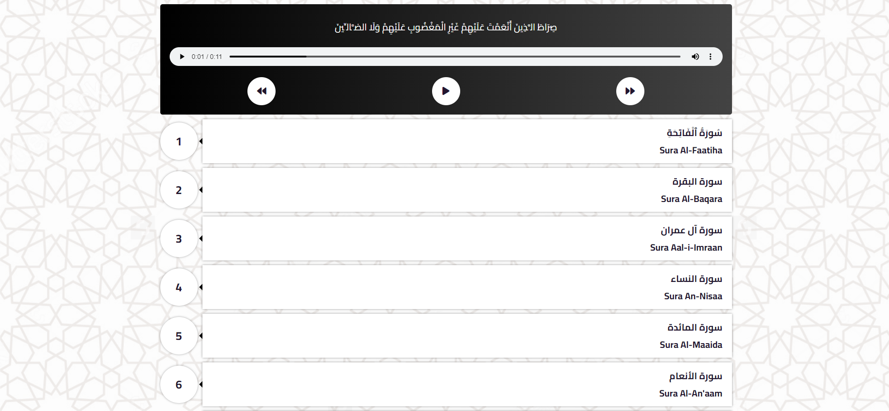
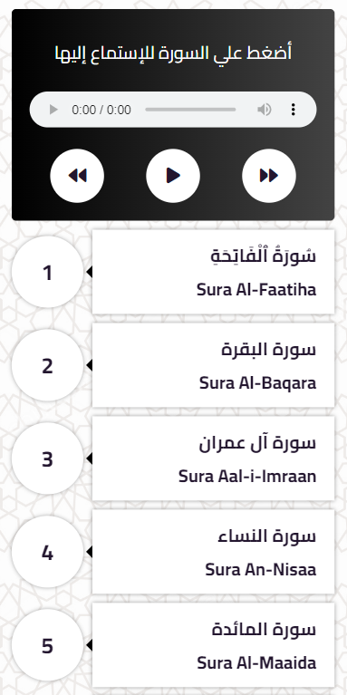

  
  
  
  

   
   
  
  

  <h2 align="center">Quran Player</h2>

  You Can Play All Surahs In Quran Player, It Is Fully Responsive. Developed Using [ PugJs - SASS - JS ]

  <a href="https://abdelrhman492.github.io/Quran-Player/"><strong>➥ Live Demo</strong></a>

 
 

### Demo Screeshots

